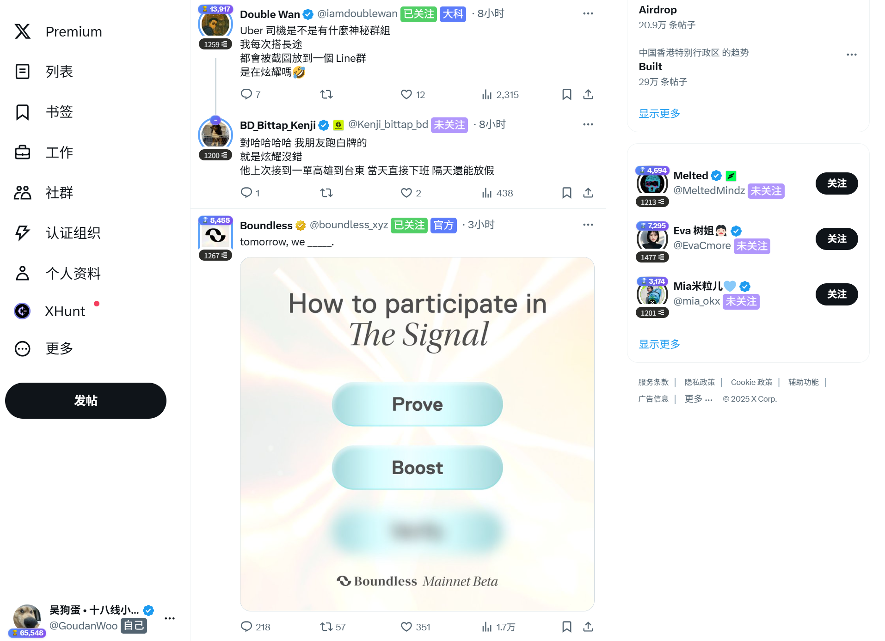

# Twitter 关注状态 + 列表标签
根据关注状态显示不同标签, 并且根据所在列表显示自定义标签, 支持多标签

当前内置标签：`自己`、`已关注`、`未关注`、`已拉黑`、`已隐藏`

## 安装

需要 UserScript 执行环境，如 **Tampermonkey** / **ViolentMonkey** / **Greasemonkey** / **ScriptCat** 等。

[点击安装脚本](twitter-following-tag.user.js?raw=1)

## 使用

### 导入数据

1. 进入自己推特的 **正在关注** 页面，点击弹出的更新**提示框** 或 相关脚本管理器中的更新**菜单**，来进行关注列表的数据更新。
   > 可供参考的页面 url: `https://x.com/{你的推特用户名}/following`
2. 进入自己推特的 **你的列表** 页面，点击弹出的更新**提示框** 或 相关脚本管理器中的更新**菜单**，来进行标签列表的数据更新。
   > 可供参考的页面 url: `https://x.com/{你的推特用户名}/lists`
3. 依次进入每个 **你的列表** - **详情页** 并点击 **成员列表**，点击弹出的更新**提示框** 或 相关脚本管理器中的更新**菜单**，来进行具体标签列表的数据更新。
   > 可供参考的页面 url: `https://x.com//i/lists/{你的列表id}/members`
4. 进入自己推特的 **已屏蔽账号** 页面，点击弹出的更新**提示框** 或 相关脚本管理器中的更新**菜单**，来进行拉黑列表的数据更新。
   > 可供参考的页面 url: `https://x.com/settings/blocked/all`
5. 进入自己推特的 **已隐藏账号** 页面，点击弹出的更新**提示框** 或 相关脚本管理器中的更新**菜单**，来进行隐藏列表的数据更新。
   > 可供参考的页面 url: `https://x.com/settings/muted/all`

### 日常使用

- 在个人页执行 **关注 / 取消关注**、**隐藏 / 取消隐藏**、**屏蔽 / 取消屏蔽**、**从列表添加/移除** 时，脚本均会自动完成相关的数据更新。

### 注意事项

- 数据更新时不要操作页面，否则可能导致脚本数据异常（如果数据异常可尝试刷新页面后重新进行数据更新）
- 执行 **从列表添加/移除** 时，可能因为浏览器响应速度等原因导致数据未更新或数据更新异常，具体以弹出的更新结果为准（如果更新异常可尝试重新打开 **从列表添加/移除** 弹窗）
- 悬浮卡片中的 **关注 / 取消关注**、**屏蔽 / 取消屏蔽** 功能暂未实现自动数据更新
- **已屏蔽账号** 和 **已隐藏账号** 页面暂未实现自动数据更新
- 网络问题（如网速过慢或网络错误）造成的页面显示异常可能导致脚本读取到错误的数据，可尝试重新进行数据更新
- 从他人公开列表导入的标签数据也是可用的，但在 **你的列表** 页面进行数据更新后会被删除
- 如果存在同名的列表，后导入的数据会覆盖旧的数据
